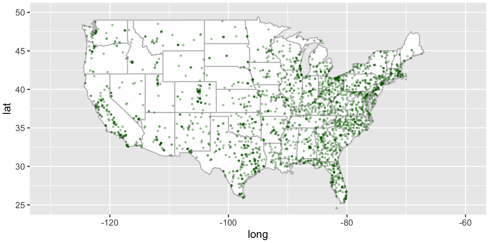
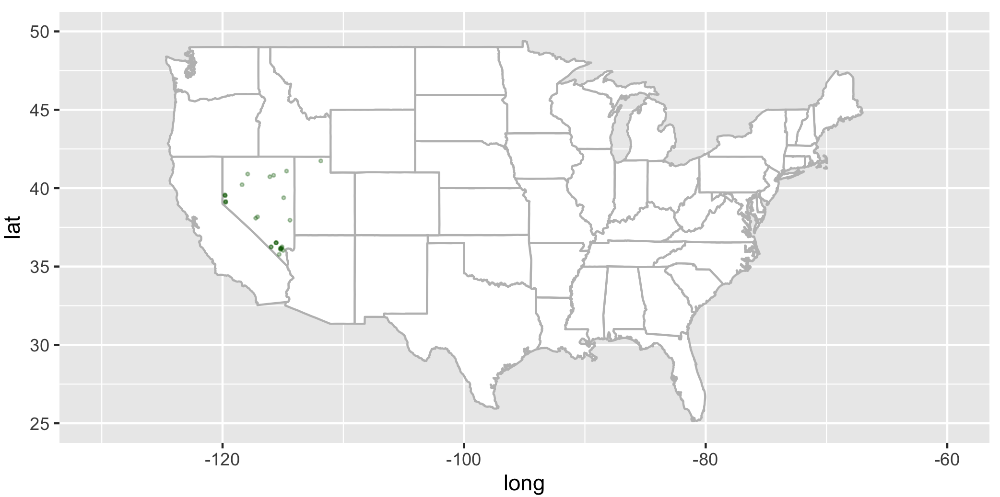
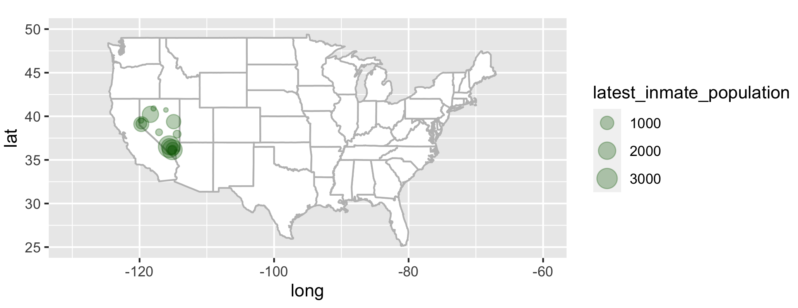

### Note: This report shows summary information from New Year Times' COVID-19 data available at the following website: 
- [https://github.com/nytimes/covid-19-data](https://github.com/nytimes/covid-19-data)

## 1. Import the prison data into R
```r
fac <- read_csv("facilities.csv")

── Column specification ────────────────────────────────────────────────────────
cols(
  nyt_id = col_character(),
  facility_name = col_character(),
  facility_type = col_character(),
  facility_city = col_character(),
  facility_county = col_character(),
  facility_county_fips = col_character(),
  facility_state = col_character(),
  facility_lng = col_double(),
  facility_lat = col_double(),
  latest_inmate_population = col_double(),
  max_inmate_population_2020 = col_double(),
  total_inmate_cases = col_double(),
  total_inmate_deaths = col_double(),
  total_officer_cases = col_double(),
  total_officer_deaths = col_double(),
  note = col_character()
)
```
```r
fac

# A tibble: 2,639 x 16
   nyt_id  facility_name           facility_type   facility_city facility_county
   <chr>   <chr>                   <chr>           <chr>         <chr>          
 1 F3EFE8… Alex City Work Release… Low-security w… Alex City     Coosa          
 2 5B9102… Alabama Therapeutic Ed… State rehabili… Columbiana    Shelby         
 3 02FB16… Bibb Correctional Faci… State prison    Brent         Bibb           
 4 6378F6… Birmingham Women's Com… State prison    Birmingham    Jefferson      
 5 EAABF9… Bullock Correctional F… State prison    Bessemer      Bullock        
 6 D19A24… Camden prison           State prison    Camden        Wilcox         
 7 F80A4A… Childersburg prison     State prison    Childersburg  Talladega      
 8 F119AF… William E. Donaldson C… State prison    Bessemer      Jefferson      
 9 41B5BD… Draper Correctional Fa… State prison    Elmore        Elmore         
10 9C1D51… Easterling Correctiona… State prison    Cilo          Barbour        
# … with 2,629 more rows, and 11 more variables: facility_county_fips <chr>,
#   facility_state <chr>, facility_lng <dbl>, facility_lat <dbl>,
#   latest_inmate_population <dbl>, max_inmate_population_2020 <dbl>,
#   total_inmate_cases <dbl>, total_inmate_deaths <dbl>,
#   total_officer_cases <dbl>, total_officer_deaths <dbl>, note <chr>
```
## 2. Draw an outline map of USA

```r
library(maps)
library(map_data)

usa <- map_data('usa')
states<- map_data('state')

usa_base <-ggplot(data= states) + geom_polygon (aes(x=long, y = lat, fill= I("white"), group= group), color="gray") + coord_fixed(1.3) + guides (fill = FALSE)
```

## 3. Print locations of prisons across the USA
```r
usa_base + geom_point(data=fac, aes(x=facility_lng, y=facility_lat), color="darkgreen", cex=0.5, alpha=3/10) + coord_fixed(xlim=c(-130, -60), ylim=c(25,50), ratio=1.3)

```
<center> 
 </img>
<center>

## 4. Remove data for all states except for your home state
```r
usa_base + geom_point(data=fac %>% filter (facility_state=="Nevada"), aes(x=facility_lng, y=facility_lat), color="darkgreen", cex=1, alpha=3/10) + coord_fixed(xlim=c(-130, -60), ylim=c(25,50), ratio=1.3)
```
<center> 
 </img>
<center>

## 5. Scale location points to prison population size
```r
usa_base + geom_point(data=fac %>% filter (facility_state=="Nevada"), aes(x=facility_lng, y=facility_lat, cex=latest_inmate_population), color="darkgreen", alpha=3/10) + coord_fixed(xlim=c(-130, -60), ylim=c(25,50), ratio=1.3)+ guides(fill =FALSE)
```
<center> 
 </img>
<center>

